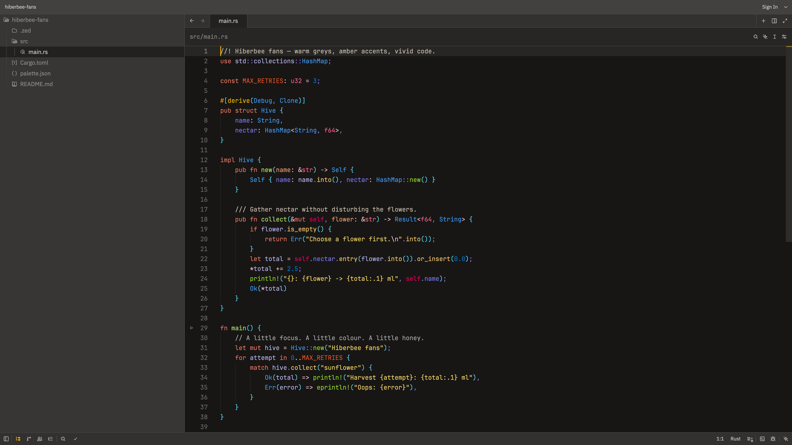

**ApisArtisan** is a dark theme inspired by the industrious bee (Apis) — precise and focused in gathering nectar. The yellow and purple pairing makes keywords, functions, structs, variables and other code elements clearly stand out, like harvesting droplets of insight across your codebase. This palette not only reduces eye strain but also helps developers quickly identify different syntactic elements, improving the overall coding experience.


## Features

- Dark background to reduce eye fatigue.
- Yellow and purple accents to highlight important code elements.
- Suitable for multiple languages (Rust, TypeScript, Go, etc.).
- Carefully tuned syntax highlighting to improve code readability and developer efficiency.

## Hiberbee fans

This extension also ships **Hiberbee fans**, an unofficial fan adaptation of the
[Hiberbee theme](https://plugins.jetbrains.com/plugin/12118-hiberbee-theme) for JetBrains IDEs.
It is not an official Hiberbee release.



Actual Zed window capture with a standalone Rust example, using JetBrains Mono
at size **15**, weight **300 (Light)** and line height **1.6**. The image is resized
for the README; the theme colors and UI are unmodified.

Based on [hiberbee/themes](https://github.com/hiberbee/themes/tree/15d6ebdd504d6e8a53caaa037dc1d68823e2b1ea),
with visual adjustments checked against Hiberbee **2024.2.28.2100** running in
RustRover **2026.1**:

- Syntax colors from IntelliJ `colors/Dark.xml`, including Rust-specific colors.
- UI palette from `themes/HiberbeeDark.theme.json`, mapped to the rendered IDE.
- Terminal ANSI colors from `src/windows-terminal/settings.json`, except for a
  more visible `bright_black` (`#525150` instead of the background's `#171615`).

Signature traits: near-black editor, warm grey chrome, amber accents, salmon
keywords, yellow strings, lime function definitions, warm yellow method calls,
blue types, pink primitive types and violet fields. Method-call color `#ffc66d`
is sampled from the running RustRover reference; it differs from the generic
`DEFAULT_FUNCTION_CALL` green in the plugin XML.

### Visual mapping

Window captures confirmed the editor and side-panel backgrounds already matched.
The surrounding UI was adjusted to the reference rather than darkening the editor:

| Area | Color |
| --- | --- |
| Editor and gutter | `#171615` |
| Side panel | `#373635` |
| Title bar | `#424140` |
| Tab bar and status bar | `#323130` |
| Toolbar and current line | `#272625` |
| Active tab | `#222120` |
| Text selection | `#214283` (opaque, matching the scheme) |

The rendered RustRover gutter is `#171615`, despite `GUTTER_BACKGROUND` being
`#272625` in the XML. The screenshot, not that unused value, is the reference here.

Zed and JetBrains do not classify every token the same way. In particular, Zed's
Rust query groups `()`, `{}` and `[]` into `punctuation.bracket`; this port uses
Hiberbee's cyan parentheses color `#57d1eb` for that combined scope. Reproducing
JetBrains' separate orange braces and green square brackets requires language
query changes, not just a theme. Likewise, Zed's generic `type` color uses the
Rust struct blue; it cannot reproduce every language-specific JetBrains rule.
Collaboration cursor colors are Zed-specific palette adaptations.

### Local install

Copy or symlink the theme into Zed's themes directory, then pick it from
`cmd-shift-p` → `theme selector: toggle`:

```sh
mkdir -p ~/.config/zed/themes
ln -sf "$PWD/themes/hiberbee-fans.json" ~/.config/zed/themes/hiberbee-fans.json
```

After editing a symlink target, notify Zed's theme-directory watcher if the
changes do not appear immediately (verified during the visual comparison):

```sh
touch -h ~/.config/zed/themes/hiberbee-fans.json
```

If the theme is still missing or stale, restart Zed and select **Hiberbee fans**.
Font and layout preferences are separate user settings; installing this extension
does not change them.

### Recommended Zed settings

[`settings.example.json`](./settings.example.json) contains the final typography
preset used with this theme:

- **Theme:** Hiberbee fans, in dark mode.
- **Editor font:** JetBrains Mono, size **15**, weight **300 (Light)**.
- **Line height:** custom **1.6**, with ligatures disabled (`calt: false`).
- **UI font size:** **16**; the UI font family is left unchanged.

This is an optional user-settings preset, not part of the theme JSON. Installing
a theme extension cannot automatically set the editor's font family, size,
weight or line height, nor install fonts. These user settings also remain in
effect when switching to another theme.

To use it:

1. Install the theme using the instructions above.
2. Install JetBrains Mono, including its Light face. On macOS with Homebrew:

   ```sh
   brew install --cask font-jetbrains-mono
   ```

   On other platforms, install it from the [JetBrains Mono project](https://www.jetbrains.com/lp/mono/).

3. Back up your user settings, then **merge** the keys from
   [`settings.example.json`](./settings.example.json) into
   `~/.config/zed/settings.json` (macOS/Linux). Update existing keys rather than
   adding duplicates. Do not replace the whole file: preserve your SSH
   connections, keymap, panel layout and other preferences. If you already have
   other `buffer_font_features`, preserve those and only update `calt`.
4. Zed normally applies user-setting changes immediately. If a newly installed
   font is not recognized, restart Zed.

The example intentionally excludes machine-specific paths, SSH connections,
autosave, keybindings and panel layout. It is kept at the repository root rather
than `.zed/settings.json`, so cloning the repo does not automatically apply it.
The **1.6** line height is a tuned preference, not a claim about JetBrains' default
spacing. Weight **300** selects JetBrains Mono Light when that face is installed;
font rendering can still differ between platforms.

### Known rough edge

`number` uses the upstream value `#0078d7`, which sits at a 4.02 contrast ratio
against the `#171615` background, the lowest of all 49 syntax scopes. It is
faithful to the original `Dark.xml`, but numeric literals do read dim. If that
bothers you, change `syntax.number.color` to `#409cff` (6.38) or `#57d1eb` (10.09).

## Credits

Hiberbee fans is based on the JetBrains Hiberbee theme by Vlad Volkov
([hiberbee/themes](https://github.com/hiberbee/themes), MIT).
The original Hiberbee copyright notice is retained in [LICENSE](./LICENSE).
