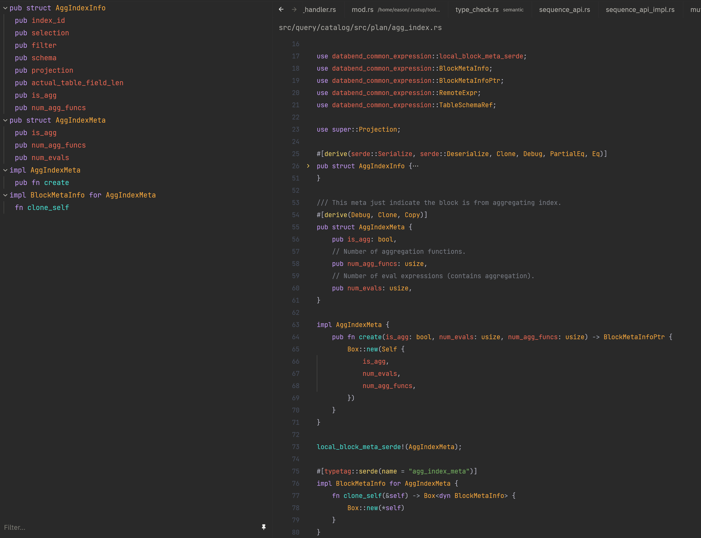

**ApisArtisan** is a dark theme inspired by the industrious bee (Apis) — precise and focused in gathering nectar. The yellow and purple pairing makes keywords, functions, structs, variables and other code elements clearly stand out, like harvesting droplets of insight across your codebase. This palette not only reduces eye strain but also helps developers quickly identify different syntactic elements, improving the overall coding experience.

## Features

- Dark background to reduce eye fatigue.
- Yellow and purple accents to highlight important code elements.
- Suitable for multiple languages (Rust, TypeScript, Go, etc.).
- Carefully tuned syntax highlighting to improve code readability and developer efficiency.
